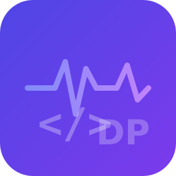

<p align="center">
  
</p>

<h1 align="center">⚡ DevPulse — Developer Toolkit</h1>

<p align="center">
  A single panel that replaces scattered productivity tools.<br>
  <strong>Bookmarks · Snippets · TODOs · Notes</strong><br>
  for VS Code + IntelliJ / Android Studio / all JetBrains IDEs
</p>

<p align="center">
  <a href="https://marketplace.visualstudio.com/items?itemName=devpulse.devpulse"></a>
  <a href="https://plugins.jetbrains.com/plugin/XXXXXXX-devpulse"></a>
  <a href="LICENSE"></a>
</p>

---

## ✨ Features

### 🔖 Smart Bookmarks
Bookmark any line with a label. One-click navigation. Persists across sessions.

### 📋 TODO Aggregator
Scans your project for `TODO`, `FIXME`, `HACK`, `XXX`, `BUG`, `NOTE` — prioritized with bugs first. Auto-refreshes on save.

### 📦 Snippet Vault
Save code as reusable snippets with `${{varName}}` variable interpolation. Usage tracking. Double-click to insert.

### 📝 Quick Notes
Per-project scratchpad stored as `.devpulse-notes.md`. Context survives between sessions.

### ⚡ Dashboard
At-a-glance stats, todo breakdown by type, and quick action buttons.

---

## ⌨️ Keyboard Shortcuts

| Shortcut | Action |
|----------|--------|
| `Ctrl+Shift+B` / `Cmd+Shift+B` | Bookmark current line |
| `Ctrl+Shift+S` / `Cmd+Shift+S` | Save selection as snippet |
| `Ctrl+Shift+N` / `Cmd+Shift+N` | Open quick notes |

---

## 📦 Installation

### VS Code
```
Extensions → Search "DevPulse" → Install
```
Or: `code --install-extension devpulse.devpulse`

### IntelliJ / Android Studio
```
Settings → Plugins → Marketplace → Search "DevPulse" → Install
```

---

## 🛠️ Development

### VS Code Extension
```bash
cd plugins/vscode-devpulse
npm install
npm run compile
# Press F5 to launch Extension Development Host
```

### IntelliJ / Android Studio Plugin
```bash
cd plugins/intellij-devpulse
./gradlew runIde    # Launches sandbox IDE
./gradlew buildPlugin    # Creates distributable zip
```

---

## 📖 Documentation

- [Usage Guide](docs/USAGE.md)
- [Changelog](CHANGELOG.md)
- [Contributing](CONTRIBUTING.md)

---

## 🤝 Contributing

We welcome contributions! See [CONTRIBUTING.md](CONTRIBUTING.md) for guidelines.

---

## 📄 License

[MIT](LICENSE) © DevPulse
